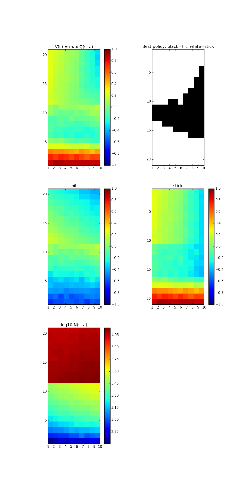
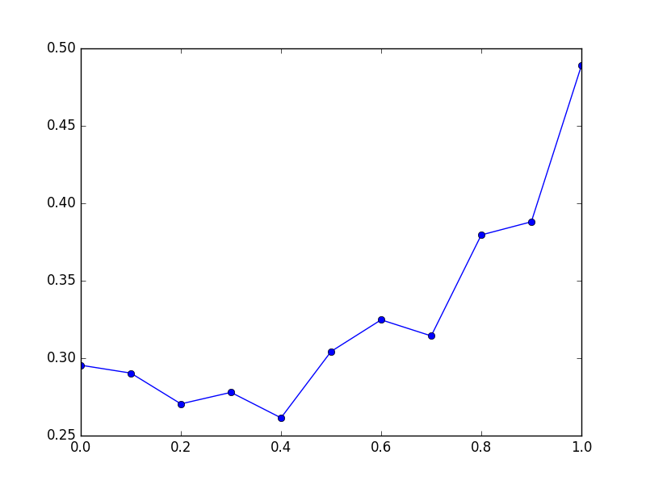

# Easy21 Example from Silver's RL course

### Value Functions & Best policy Learned by MC

### Mean Squared Error Cureve
MC with 1M episodes as standard  
Sarsa(lamda) with 1k episodes as competitors  
Lambda = 0 : .1 : 1.0  

### Environment & Dependencies
Linux (Ubuntu) 16.04  
Python 3.5  
- Numpy
- Matplotlib

### 
You can reproduce the results by executing `ez21.py` with two arguments:  
1. `N_ITER` that specifies the number of episodes of the MC player.  
2. `N_ITER_SARSA` that specifies the number of episode of the Sarsa players.  
The resulting value function Q(s, a) will be stored in `Qsa.npf`,  
with shape [12, 21, 10, 2] = [players, player_card_sum, dealer_showing, actions].
The first item is the MC player, and the remaining 11 items are Sarsa players
(lambda = 0.0: 0.1: 1.0).  

You can also use `np.fromfile` function to load the `Qsa.npf` to see my results from 1 millon epsides of MC (and 10k episode for Sarsa).

### Incomplete and Additional parts
- Function approximation
- Real Blackjack
- Two learning players
